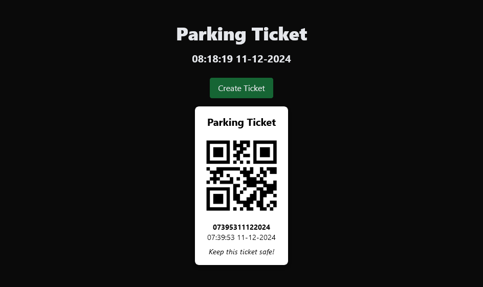
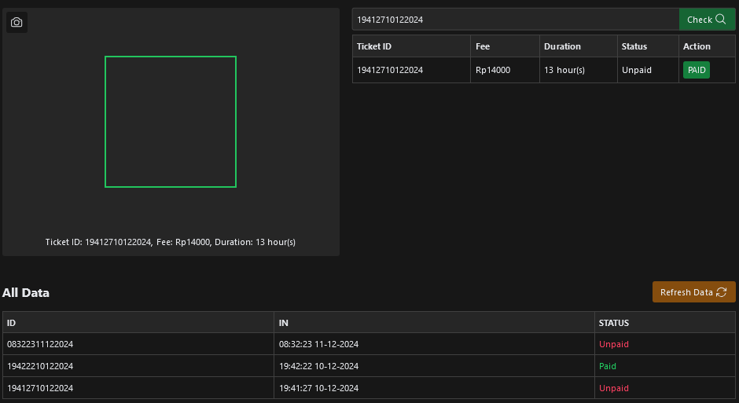

# Tiket Parkir Scanning NodeJS


### Run

```
git clone https://github.com/fitri-hy/tiket-parkir-scanning-nodejs.git
cd tiket-parkir-scanning-nodejs
npm install
node app.js
```

### Url

```
# Lading
http://localhost:3000/

# Admin
http://localhost:3000/admin
```


